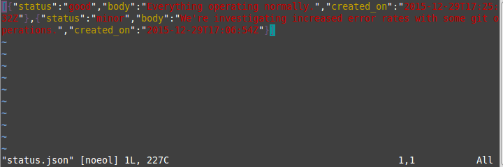
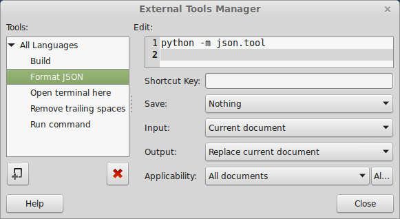
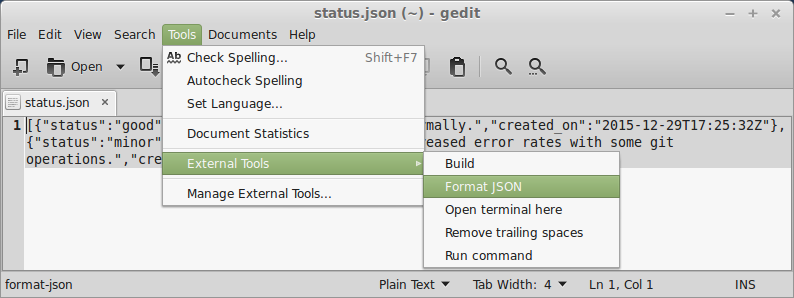

APIs are primarily designed for computers, not for humans, yet sometimes you need to dig into raw response from such APIs.
If such a response (let's assume you're interested only in it's payload) happens to be an unformatted JSON document then debugging it won't be a pleasant experience unless you format it.

There are many browser addons such as [Postman](https://www.getpostman.com/) or [HttpRequester](https://addons.mozilla.org/en-US/firefox/addon/httprequester/) that allow you to view pretty printed responses but they all lack the power of command line and capabilities of text editors not to mention that they make you leave the command line and click over a GUI.
Of course also browser addons provide useful features (e.g. request history) that make you more productive but for this blog post we're gonna assume that our case is easier to solve without leaving the command line or text editor.

Let's take a look at a simple response from GitHub Status API. Looking at the raw payload doesn't feel home:

```sh
$ curl -s https://status.github.com/api/messages.json
[{"status":"good","body":"Everything operating normally.","created_on":"2015-12-29T17:25:32Z"},{"status":"minor","body":"We're investigating increased error rates with some git operations.","created_on":"2015-12-29T17:06:54Z"}]
```

but a simple pipe to Python module makes it much more readable:

```sh
$ curl -s https://status.github.com/api/messages.json | python -m json.tool
[
    {
        "body": "Everything operating normally.",
        "created_on": "2015-12-29T17:25:32Z",
        "status": "good"
    },
    {
        "body": "We're investigating increased error rates with some git operations.",
        "created_on": "2015-12-29T17:06:54Z",
        "status": "minor"
    }
]
```

and moreover allows you to pipe it further.

So simple, yet so powerful and if you need to go over a record of such requests or just need to use a text editor it doesn't get more complicated.
You know what I mean if you're a vim user, you just execute `%!python -m json.tool` in command-line mode.

<figure>
	
	<figcaption>Formatting JSON documents in vim</figcaption>
</figure>

And if you've been using vim for years, yet have not been able to exit it :D you still have other options.
For example gedit allows you to execute external tools once you enable External Tools plugin.
All you need to do in that case is create a new external command and then execute it.

<figure>
	
	<figcaption>Defining format JSON command in External Tools Manager</figcaption>
</figure>

<figure>
	
	<figcaption>Executing format JSON command</figcaption>
</figure>

And as in case of creating an alias for `python -m json.tool` or mapping a key in vim you can as well assign a shortcut for that command in gedit.

P.S. If you need to debug unformatted XML documents follow the same route with `xmllint --format -`.
