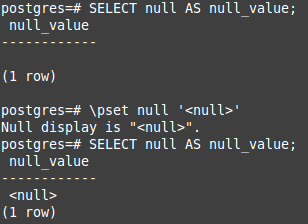

I like tools that allow you to stay efficient and one of such tools is psql.
I have not yet seen any other PostgreSQL client that can beat psql in term of productivity.
There are other clients that are better tailored for some types of activities but in terms of overall productivity none of them has been able to beat psql.

Ok, let's skip the introduction and take a look at a fraction[^1] of existing configuration options that allow you to tailor psql for your needs and get a perspective of what's possible.

### Environment-aware command history

Like any good shell psql saves commands you execute to allow you search and re-execute them.
By default all commands are stored in a single file (`~/.psql_history`) but you can easily store command history per-database, per-user, per-host, etc..
For example to store separate command history per-database and not let it be overwritten by commands from more frequently used database just `\set HISTFILE ~/.psql_history- :DBNAME` in `~/.psqlrc`.

### Changing the prompt

Let's `\set PROMPT1 '%[%033[1m%]%M %n@%/%[%033[0m%]%# '` and see how it looks like compared to the default one.

If you want to deconstruct the incantation we typed then it goes like this:
`%[%033[1m%]` sets font to bold black[^2], then it prints the hostname (`%M`), username (`%n`) and database name (`%/`) then sets the font to non-bold black (`[%033[0m%]`) and prints `#` if the user is a superuser or `>` otherwise.

As you can probably guess besides the `PROMPT1` there is also `PROMPT2` and even `PROMPT3`.
`PROMPT1` is used when psql requests a new command, `PROMPT2` is used when you input a multiline command and `PROMPT3` is used when you are expected to type in row values while running `SQL COPY`.

### Tab completion

If you want to use uppercase SQL keywords to make your queries more readable then tab completion is what you are looking for.
Tab completion makes it a no-brainer once you `\set COMP_KEYWORD_CASE upper`.

### Printing `NULL` values

By default psql prints `NULL` values as blank spaces, but you can alter it by setting `\pset null '<null>'`[^3].

### Pager behavior

By default psql uses a pager to paginate text when it deems it necessary but you can make it always always use (`\pset pager always`) or even disable it (`\pset pager off`).
You can even change the pager itself by setting `PAGER` environment variable.

### Making configuration changes persistent

All of the mentioned options beside the command history file configuration can be set directly on an active psql session and are valid for it's duration.
To make configuration changes persistent they have to be set in `~/.psqlrc`.

[^1]: for more configuration options consult [PostgreSQL documentation](http://www.postgresql.org/docs/9.4/static/app-psql.html)
[^2]: it turns bold white on a black background
[^3]: we have to use `pset` instead of `set` because we're affecting query output
