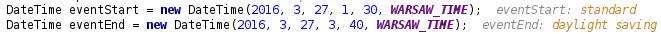
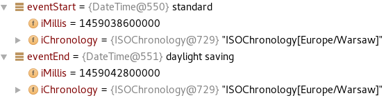
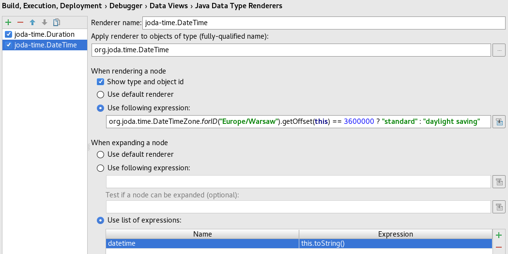

When I step through code in a debugger it usually means I'm trying to understand why that code behaves differently than expected.
In such situations I especially want my IDE to present me only with data relevant to the problem at hand.
Unfortunately my IDE doesn't have a crystal ball that tells it what context I'm in and what data is relevant in the given context.
The IDE just displays variables used in the code and allows me to evaluate custom expressions to dig things further.
Sadly displayed data often tends to either be meaningless in the given context or contain a lot of noise that I have to filter out by myself risking overlooking significant pieces.
Moreover evaluating expressions while being invaluable also means manual work, I have to open evaluate expression dialog and type in the expression risking losing focus of the main problem.
To sum it up I want to be presented only with relevant data and I want it to be presented in a meaningful way.
This doesn't sound feasible without me helping my IDE.
Fortunately my IDE, [IntelliJ IDEA](https://www.jetbrains.com/idea/), has a really useful feature called custom type renderers that allows me to provide that necessary help to my IDE.
Let's see how those custom type renderers can help debug things.

Let's imagine a simple scenario where we calculate an important value based on a price plan and event duration:

```java
Duration eventDuration = new Duration(eventStart, eventEnd);
return estimateCost(pricePlan, eventDuration);
```

This piece of code works as it should until one day we notice strange results coming out of it.
Fortunately we are able to capture inputs that allow us to reproduce the problematic scenario:

```java
PricePlan pricePlan = PricePlan.REGULAR;
DateTime eventStart = new DateTime(2016, 3, 27, 1, 30, WARSAW_TIME);
DateTime eventEnd = new DateTime(2016, 3, 27, 3, 40, WARSAW_TIME);
```

Not being able to deduct where the problem lies by reasoning about the code we run it through a debugger.
Based on the inputs we assume that `PricePlan.REGULAR` and a duration equal to `2 hours 10 minutes` (in milliseconds [^1]) is passed in to the `estimateCost` method.


The debugger shows us that we indeed pass in `PricePlan.REGULAR` as the first parameter and some duration as the second one.
Unfortunately the way [org.joda.time.Duration](http://www.joda.org/joda-time/apidocs/org/joda/time/Duration.html) value is presented to us is meaningless, thus we have to manually evaluate an expression to get the data we need:


We can see that event duration is equal to `1 hour 10 minutes` instead of `2 hours 10 minutes`.
Before we dig into the why, let's focus on how can we make this information easily accessible by using custom type renderer.
Let's create one that displays [org.joda.time.Duration](http://www.joda.org/joda-time/apidocs/org/joda/time/Duration.html) values as a result of the following expression:

```java
org.joda.time.format.PeriodFormat.getDefault()
    .withParseType(org.joda.time.PeriodType.time())
    .print(this.toPeriod())
```


Now the data displayed by the debugger starts being useful:


Having significant data on the first plan let's go back to analyzing why the duration of an event that starts at `1:30 Warsaw Time` and ends at `3:40 Warsaw Time` is `1 hour 10 minutes` instead of `2 hours 10 minutes`.


As I mentioned in the beginning it's easy to overlook important data when you are filtering out noise by yourself.
You want that noise to be automatically filtered out.
Given character sequences as long as `2016-03-27T01:30:00.000+01:00` and `2016-03-27T03:40:00.000+02:00` you probably focused on making sure that they represent the same day and then extracting hours.
Since both dates were in the same time zone chances are high you simply ignored time offsets.
Of course you can alter the way dates are represented so they are easier to grasp and analyze but since you already know where the problem lies let's make the debugger clearly say it by rendering [org.joda.time.DateTime](http://www.joda.org/joda-time/apidocs/org/joda/time/DateTime.html) values as a result of the following expression:

```java
org.joda.time.DateTimeZone.forID("Europe/Warsaw")
    .getOffset(this) == 3600000 ? "standard" : "daylight saving"
```


Yes, you guessed it right, there was a time change between the start and the end of an event:



On `27 March 2016` at `2:00` in `Europe/Warsaw` time zone clocks are turned forward by 1 hour to change from [Central European Time](https://en.wikipedia.org/wiki/Central_European_Time) to [Central European Summer Time](https://en.wikipedia.org/wiki/Central_European_Summer_Time) "so that evening daylight lasts an hour longer, while sacrificing normal sunrise times"[^2].
Now the debugger clearly says it but at the same time makes it hard to figure out what time those [org.joda.time.DateTime](http://www.joda.org/joda-time/apidocs/org/joda/time/DateTime.html) values represent:



Let's make that information easily available by further configuring [org.joda.time.DateTime](http://www.joda.org/joda-time/apidocs/org/joda/time/DateTime.html) type renderer, this time focusing on how those values are represented after node expansion in the data view:



With the simple `this.toString()` expression we get exactly what we need:


As you have seen in this simplistic example custom type renderers can make your debugging session way easier by hiding irrelevant data and putting significant data on the first plan.
Another noteworthy aspect of custom type renderers is that they automatically re-render all displayed variables after any change made to their definition (including creation and removal) so that you don't have to rerun your debugging session.
In fact all the screenshots in this article come from the same debugging session.

[^1]: [org.joda.time.Duration](http://www.joda.org/joda-time/apidocs/org/joda/time/Duration.html) represents length of time in milliseconds
[^2]: quote from [Wikipedia: Daylight saving time](https://en.wikipedia.org/wiki/Daylight_saving_time)
