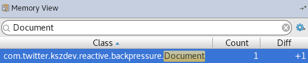
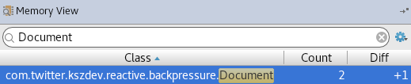

When I'm working with a repository that returns Flux, RxJava 1.x Observable or some other reactive dataflow I wonder if it supports backpressure, especially if the returned dataset might contain more than a handful results.
The bigger the dataset the more crucial it is to have backpressure support.
In the extreme cases without backpressure support we may end up with an OutOfMemoryError, while we could have handled the whole dataset without any issues if backpressure was supported.
In less extreme cases we may end up fully utilizing available resources and making the application unresponsive for significant period of time.
When processing larger datasets without backpressure support we may also experience longer or more frequent stop the world pauses leading to worse latency or noticeable drop in throughput due to the pressure put on garbage collector.

Unfortunately often it's not that obvious nor documented whether the repository supports backpressure all the way down the stack.
Due to that I developed a simple test for backpressure support[^1].
It requires writing a simple, single-threaded subscriber to process data coming from the repository:

```java
documentRepository.findAll()    // this returns Flux<Document> but does it support backpressure?
        .subscribe(document ->
                LOG.debug("Processing {}", document));
```

Within that implementation we need to put 2 breakpoints, one where the repository is queried (documentRepository#findAll) and the other one where data processing happens (LOG#debug).
Then we run it in the debugger with Memory View opened so that we can track how the heap changes between breakpoints.

To demonstrate this process let me show you 2 implementations and the results of hitting the second breakpoint for both of them.

Let's say that the repository contains 10 000 documents:

```sql
INSERT INTO Document (id, content) VALUES
  (1, 'large blob'),
  (2, 'large blob'),
    ...
  (10000, 'large blob'),
```

First let's test JPA-based implementation:

```java
class JpaBasedDocumentRepository implements DocumentRepository {

    private final EntityManager entityManager;

    JpaBasedDocumentRepository(EntityManager entityManager) {
        this.entityManager = entityManager;
    }

    public Flux<Document> findAll() {
        return Flux.fromStream(
                entityManager.createQuery("from Document d")
                        .getResultList()
                        .stream());
    }
}
```

When we hit the second breakpoint we can see that the whole dataset was loaded into memory (or the application crashed with OutOfMemoryError if the dataset was large enough) even though only one document was needed at that time (the subscriber processes results sequentially):


This repository, even though it returns Flux that is capable of supporting backpressue, does not support backpressure, it just loads the whole dataset into memory at once.

Let's test another implementation, this time a Hibernate-based one:

```java
class HibernateBasedDocumentRepository implements DocumentRepository {

    private final HibernateEntityManager entityManager;

    HibernateBasedDocumentRepository(EntityManager entityManager) {
        this.entityManager = entityManager.unwrap(HibernateEntityManager.class);
    }

    public Flux<Document> findAll() {
        Stream<Document> resultStream = entityManager.createQuery("from Document d")
                .stream();
        return Flux.fromStream(resultStream)
                .doOnTerminate(resultStream::close);
    }
}
```

In this implementation we create Flux from the stream opened directly on query results.

Let's take a look at the heap once we hit the second breakpoint:



We can see that only one document was loaded, exactly as much data as we needed to process at that time.
If we resume processing and hit that breakpoint for the second time we will see another document being loaded:



Now we have 2 documents loaded, and if we resume processing and hit that breakpoint for the third time we will have 3 documents loaded and so on.
At some point GC will kick in and collect[^2] all the loaded documents besides the one currently being processed, which leads to better memory utilization and making the application more resilient.

In some cases results of this test might not be that simple to interpret, e.g. some implementations might support backpressure but load results in batches to reduce communication overhead, but knowing the basic characteristics of the dataset and the datastore under test you should be able to use this test to verify whether the repository supports backpressure.

[^1]: in this test we examine repositories running in-process with out-of-process datastore hence the way of handling backpressure on the publisher side is as important as allowing subscribers to signal the publisher that the rate of emission is too high
[^2]: in case of JPA and its' implementations you have to remember that managed entities won't be garbage collected
